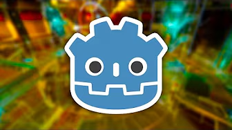
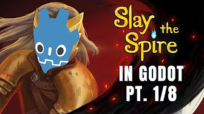
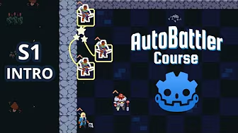
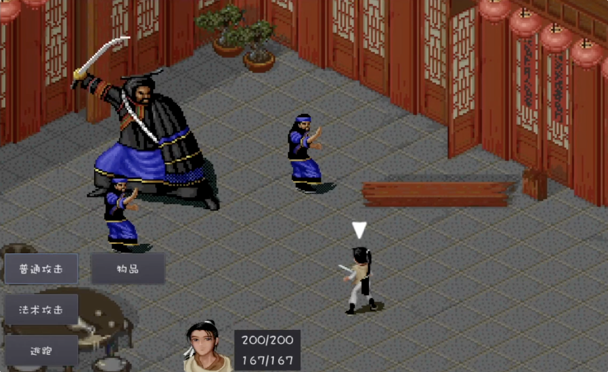
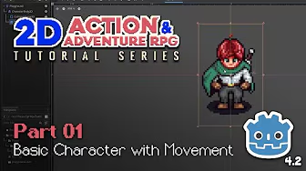

## 🌟🌟🌟🌟🌟

### The Ultimate Introduction to Godot 4 @Beginner

{: width="336" height="188" .w-50 .left}

- [YouTube](https://www.youtube.com/watch?v=nAh_Kx5Zh5Q)
- [bilibili](https://www.bilibili.com/video/BV1pu4y1b7p6/)
- [Github](https://github.com/clear-code-projects/UltimateGodotIntro2D)

   
### Intermediate Card Game @Junior

{: width="336" height="188" .w-50 .left}

- [YouTube](https://www.youtube.com/playlist?list=PL6SABXRSlpH8CD71L7zye311cp9R4JazJ)
- [bilibili](https://www.bilibili.com/video/BV1PC411L78f)
- [Github](https://github.com/guladam/deck_builder_tutorial/tree/season-1-starter-project)

   
### Godot 4 Autobattler @Junior

{: width="336" height="188" .w-50 .left}

- [YouTube](https://www.youtube.com/playlist?list=PL6SABXRSlpH_0UEV3gJ53I7a2eGL8pqs3)
- [bilibili](https://www.bilibili.com/video/BV1oAHke4EYm)
- [Github](https://github.com/guladam/godot_autobattler_course/tree/starter-project)

   

## 🌟🌟🌟🌟

### 复刻仙剑1 Turn-Based 战斗 @Junior

{: width="316.6" height="193.852" .w-50 .left}

- [bilibili](https://space.bilibili.com/12263615/lists/636637?type=series)

     
### Make a 2D Action & Adventure RPG in Godot 4 @Junior

{: width="336" height="188" .w-50 .left}

- [YouTube](https://www.youtube.com/watch?v=QPeycNt29tY)
- [bilibili](https://www.bilibili.com/video/BV1sB2NYLEwj)
- [Github](https://github.com/michaelmalaska/aarpg-tutorial)
- [Assets](https://michaelgames.itch.io/2d-action-adventure-rpg-assets)

   

## Blog

- [Let's Learn Godot 4 by Making an RPG @Beginner](https://dev.to/christinec_dev/lets-learn-godot-4-by-making-an-rpg-part-1-project-overview-setup-bgc)
