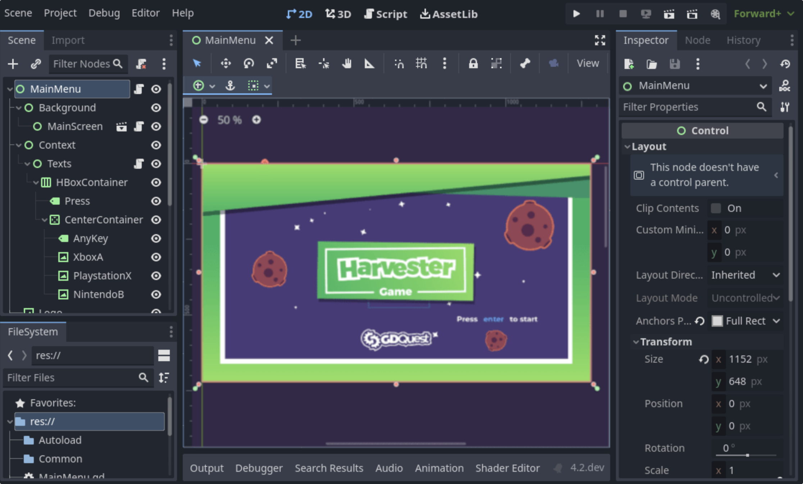
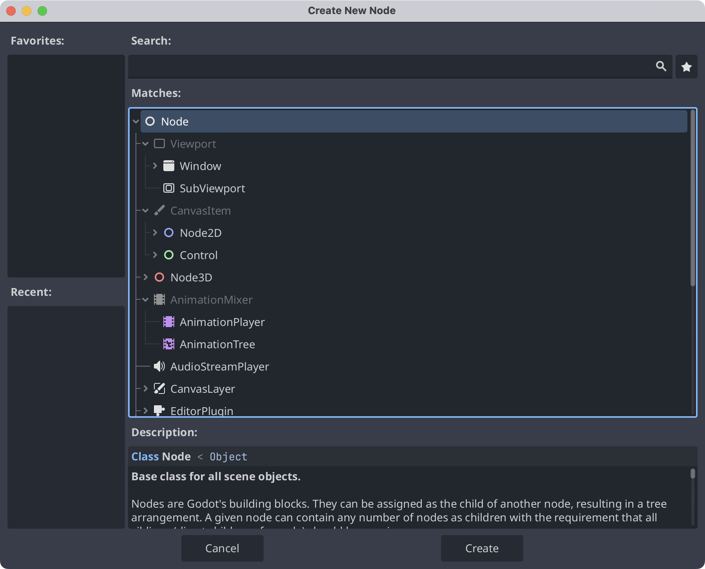
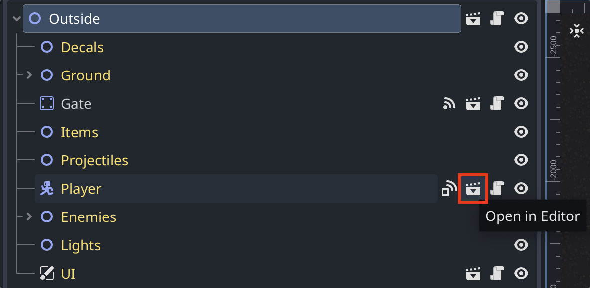

这篇博客记录于我在完成了一个 overview 级别的项目之后，也是我在godot上的第二个项目。
[这套教程](https://www.bilibili.com/video/BV1pu4y1b7p6)介绍了很多内容，在跟着做了一遍之后，我决定写一写博客来总结一下知识点。
我会尽量根据教程顺序以及[官方文档](https://docs.godotengine.org/en/stable/)的顺序来回顾与总结。

本套随笔不保证完全原创。也许会有大量的翻译，或者引用。当然，也肯定会有我自己的理解。

> 这套随笔博客大概率只包含 2d 向的内容。所讨论的知识仅限于 2d 领域。此外，知识点不一定准确，一方面我也在持续学习，另一方面 Godot 也在随着时间更新，有些概念可能会随着他的更新而过时。
> 欢迎给我指出错误或者交流，可以在文章下方的留言板上给我留言。
{: .prompt-tip }

## 1. Scene 场景

在 Godot 中，你将制作出很多场景来完成你的游戏。一个场景可能是一个角色、一把武器、一个菜单或者一套 UI。

通常来说，场景都是可以复用的。也就是说，当你完成了一个场景之后，你可以随时随处的使用他。你可以在 Godot 中通过组合你的场景来构建属于你自己的游戏。

## 2. Node 节点

节点是 Godot 中组成场景的最小单元。

不同的节点具有不同的功能，我们使用节点来构建场景。通常来说，一个场景会包含多个节点，也可以说场景就是一棵节点树。

所有节点都具有如下特征：
1. 可编辑的属性
2. 他们每一帧都会接收 callback 来更新
3. 你可以 extend 他们来扩展新的属性和方法
4. 你可以把他们加入到新的节点当中去

## 3. Scene Tree 场景树

在构建好场景之后，我们需要构建游戏的各个关卡或者地图。我们可以这样理解，一个场景是一棵节点树，那么一个关卡就是一棵场景树。

带有这个图标的就是示例关卡中的场景，我们可以点击场景图标来返回该场景，以便我们重新编辑他。

## 4. Signal 信号

信号在 Godot 中是个及其重要的概念，不过现在，我们可以先简单理解一下：信号是不同场景之间交流信息的重要手段。

每个节点会有属于他自己的信号，我们也可以自定义信号。在接下来的随笔中，我会不断完善对信号的总结。

When a certain action happens to a node(A body entering an area; a timer running out; 2 bodies colliding;).
You can tell the affected node to send a signal, which basically means that you are running a function.

You can create your own signals. The major limitation of signals is that they only work between nodes in the same scene.
Triggering custom signals can help to communicate between scenes.
