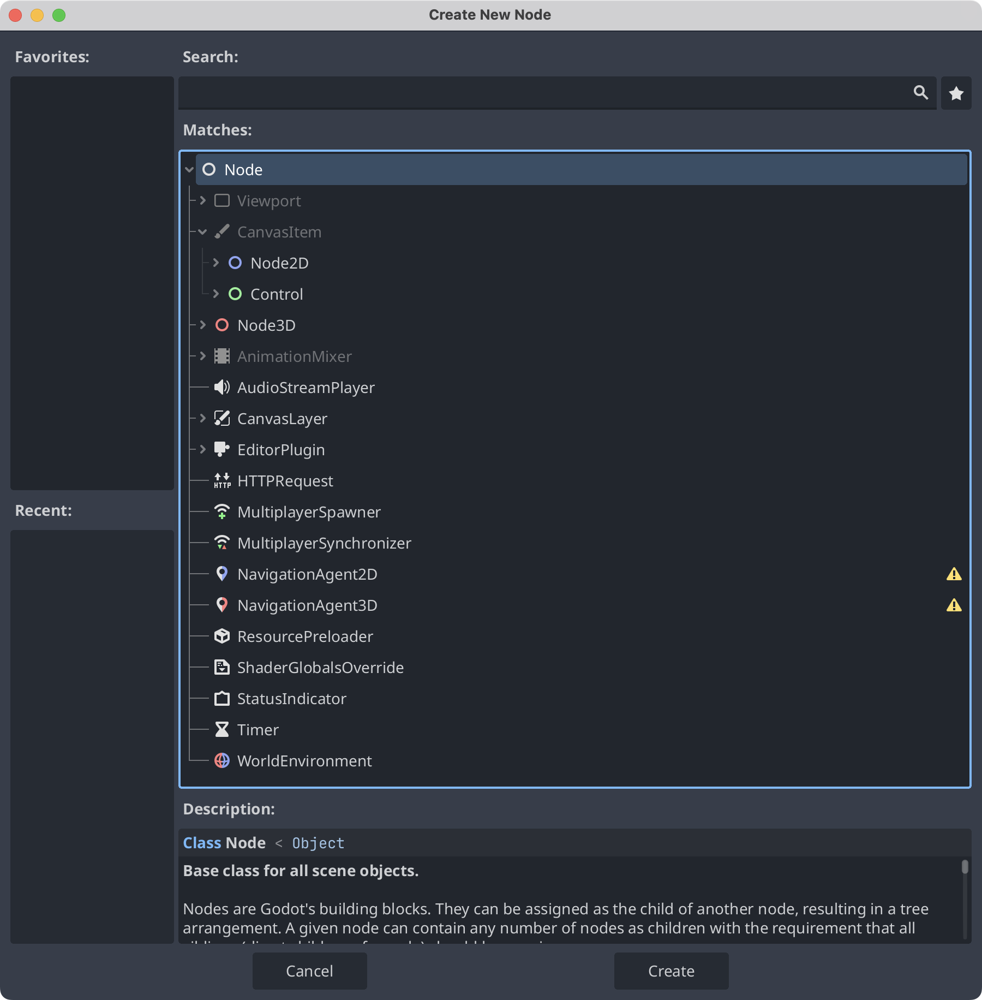

前文中我们提过，节点是构建场景的最小单元。不同的节点拥有不同的属性，他们可以实现不同的功能。通过 <kbd>Create New Node</kbd> 可以看到，根节点是 **Node**。在 **Node** 下有 **CanvasItem** 节点，他是 2D 空间下的抽象基类。**Node2D** 是 2D 游戏对象的父类，**Control** 是 UI 节点的抽象父类。我们研究的大部分节点，都是 **Node2D** 和 **Control** 的子类。

> There are lots of inbuilt functions you will use, they all start with an `_`.
> 1. `_ready()` is run when a Node is added to the node tree.
> 2. `_process()` is run on every frame of the game.
{: .prompt-tip }

You can target other nodes in 2 ways:
1. `get_node("node path")`
2. `$node path`

You can also give nodes a unique name. When you capture a node in code you can access their properties and call methods on them.

> A major aspect of Godot is to make nodes communicate with each other.
{: .prompt-info }

## 1. Area2D

An area that can check if another body entered. Can be moved by changing the position.

*Check if player entered a house, the lasers will be areas.*

他是一个可以检查另一个物体是否进入的区域。

## 2. StaticBody2D

A static body that other bodies collide with. Not supposed to be moved.

*Any static object: Walls, beds, obstacles...*

## 3. RigidBody2D

Moving body that moves via physics(like a cannonball). Set an initial velocity.

*The grenade*

RigidBody2D has a gravity settings that is 1 by default. You can set physics behaviour in the inspector and additional options are set via a PhysicsMaterial.

And you are supposed to set a starting velocity, the movement is then influenced by physics.

## 4. CharacterBody2D

Moving body controlled by code. Inbuilt methods.

*Any entity that is controlled by code: The player & all enemies.*
