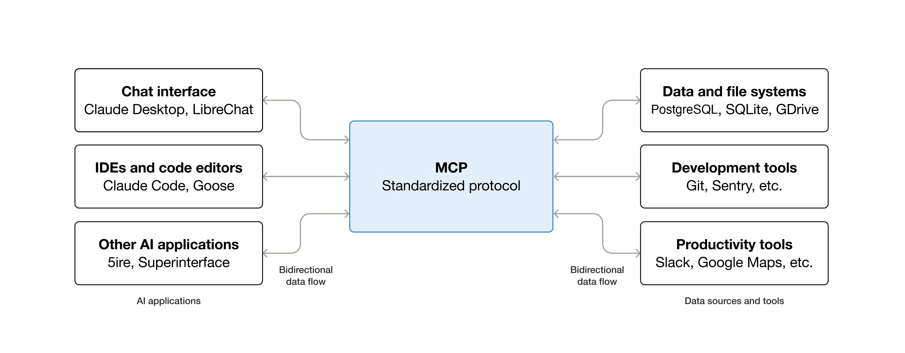

Agent 系统的本质还是一个复杂的软件系统，依然需要以下工程能力以及对 AI  系统特有范式的理解和实践。

可观测性

高并发

低延迟

成本控制

从“确定性”的编程逻辑，转向“概率性”的系统构建。

## 1 理解 LLM 的能力边界和工作原理

不能把 LLM 当成一个黑盒 API，需要知道他能干嘛和不能干嘛以及大概是怎么干的。

### 1.1 基础概念

Embedding

为什么需要向量数据库

Cosine Similarity

RAG（检索增强生成）的本质

ReAct（Reasoning and Acting）模式如何让 LLM 和外部工具交互

Function Calling 的工作流程

以上理解就行，不用背。比如 RAG，不能只知道喂知识库，要知道 RAG 解决的是 LLM 内部知识老旧和胡说八道（幻觉）的问题。核心挑战在于“精准检索”到相关性最强的上下文。

### 1.2 动手写一个丐版的 RAG

不要上来就用 LangChain。先用 sentence-transformers 库把文档切块、生成向量存到一个 Faiss 或者 ChromaDB 的本地实例里。

当用户提问时，手动去查向量库，把查出来的文本拼到 Prompt 中，再去调 OpenAI 的 API。

过程中，你会遇到问题：

文档怎么切分效果最好？

Top-K 设置成多少合适？

搜出来的东西不相关怎么办？

这些才是 Agent 工程真正的难点。

## 2 以真实场景驱动，构建一个代表作

需要一个体现综合能力的项目，需要麻雀虽小，五脏俱全。不要选 AI 聊天机器人这种大而空的目标，一个比较好的目标比如：智能投后报告分析助手。

业务场景：你所在的公司投资了很多初创企业，每个季度都会收到这些企业的 PDF 格式的财报和业务进展报告。目标是做一个Agent，能快速阅读这些报告并回答关键问题，如：

A 公司这个季度的营收环比增长了多少？

B 公司的主要风险是什么？

把 C 和 D 公司的用户增长数据做个对比。

要实现这个需求，就需要折腾以下这些事儿：

复杂数据处理：PDF 中的表格怎么提取？图片中的文字怎么办？参考下 unstructured.io 库。

核心 RAG 流程：简单的文本块检索效果很差，就得研究更高级的 RAG 策略，比如 HyDE（Hypothetical Document Embeddings）或者 Multi-Query Retriver，甚至考虑 Graph RAG，把报告里的实体和关系抽出来建成知识图谱。

Agentic 逻辑和 Tool Use：当需要计算环比增长时，LLM 是算不明白的。这个时候就必须引入 Tool Use / Function Calling。需要自定义一个工具，当 LLM 再识别出计算意图时自己去调用这个函数，拿到结果后再回答。

以上这个过程要怎么调试？LLM 为什么不按我们的意愿调用工具？也许需要用 LangGraph 或者自己实现一个 ReAct 循环来管理这个复杂的执行逻辑。

最终，我们需要评估。Agent 做完以后，如何验证他比人看报告更好？我们需要构建一套评估体系。最简单的，找 20 份报告，设计 100 个问题和标注答案，形成一个评估集。然后用 Agent 跑一遍，使用 Ragas 这类框架计算一下 faithfulness（忠实度）、answer_relevancy（相关性）等指标。没有评估，优化都是玄学。
评估里也会有很多坑，比如用户换个问法，生成的报告就驴唇不对马嘴，有可能是评估集太小，太干净了，没有覆盖真实、复杂的线上场景，需要自己踩坑。

这个项目搞下来之后，简历和面试中就有料可聊，比如你可以讲

PDF 是如何解析的，遇到了什么问题

对比了哪些 RAG 策略，为什么最终选了这个方案

如何设计和调试 Tool

最重要的是，如何通过量化评估指标，提高了 Agent 的准确率，从 60% 提升到了 85%。

## 3 生产化

### 3.1 成本和延迟意识

LLM API 是按 token 烧钱的，一个设计不好的 Agent 链条，一个请求进来可能要调用 LLM 十几次，成本直接爆炸，所以我们可以考虑

怎么设计缓存策略？

怎么通过更小的模型（比如 fine-tune 一个本地模型）来处理某些固定任务？

怎么优化 Prompt 来减少 token 消耗？

### 3.2 可观测性 Observability

一个 Agent 的执行过程是个复杂的黑盒，需要引入类似 LangSmith / WanDB 这样的工具去追踪每一次调用的 Prompt、返回结果、中间步骤、token 消耗。线上出了问题可以快速定位哪个环节出问题了。

### 3.3 模型和工具链

除了 OpenAI，还得了解开源模型，如 Llama、Mistral 系列。知道怎么用 vLLM 或者 Ollama 部署他们。
向量数据库除了 Chroma，也得看看 Milvus, Weaviate 这种生产级的。

## 4 更复杂的探讨

Memo 的设计：长对话的上下文怎么处理？总结后怎么存储？多少轮后不支持回溯？如何评价回答质量？

语义 Embedding 模型如何选择？如何确定业务最适合的 Embedding 模型？（这块知识库和意图识别都会用到）

多意图并发以及 NER，怎么确定用户的真实意图？

中途任务强行结束怎么办？如何撤销？多工具分布调用如何解决？如何规划任务流程？

单/多模态 RAG 检索怎么做？如何提高检出？如何评价检出质量？多工具 Prompt 下，消融怎么展开？知识库文档怎么切片合适？

如何评价一个 Agent 的解决问题的质量？（是走完了用户指定的任务？还是各个任务节点完成的质量？）

[MCP (Model Context Protocol)](https://modelcontextprotocol.io/docs/getting-started/intro) is an open-source standard for connecting AI applications to external systems.

Using MCP, AI applications like Claude or ChatGPT can connect to data sources (e.g. local files, databases), tools (e.g. search engines, calculators) and workflows (e.g. specialized prompts)—enabling them to access key information and perform tasks.

Think of MCP like a USB-C port for AI applications. Just as USB-C provides a standardized way to connect electronic devices, MCP provides a standardized way to connect AI applications to external systems.

What can MCP enable?

* Agents can access your Google Calendar and Notion, acting as a more personalized AI assistant.
* Claude Code can generate an entire web app using a Figma design.
* Enterprise chatbots can connect to multiple databases across an organization, empowering users to analyze data using chat.
* AI models can create 3D designs on Blender and print them out using a 3D printer.

Why does MCP matter?

Depending on where you sit in the ecosystem, MCP can have a range of benefits.

Developers: MCP reduces development time and complexity when building, or integrating with, an AI application or agent.

AI applications or agents: MCP provides access to an ecosystem of data sources, tools and apps which will enhance capabilities and improve the end-user experience.

End-users: MCP results in more capable AI applications or agents which can access your data and take actions on your behalf when necessary.

Claude 官方入门基础教程，了解整个 AI Agent 的工作原理，整个流程和知识点都会讲到：https://anthropic.skilljar.com/claude-with-the-anthropic-api
GitHub 优质项目

https://github.com/FoundationAgents/OpenManus.git

https://github.com/agentuniverse-ai/agentUniverse.git

Gemini-cli / Kode (Claude Code 逆向工程版）

为什么 LangGraph 要用 StateGraph？和普通的函数调用链有什么本质区别？

设计一个支持百万并发的 Agent 调度系统

第一层/API 调用工程师：会用 LangChain/LangGraph 这些框架
第二层/系统设计工程师：能理解 Agent 的底层架构，知道 ReAct / Plan-and-Execute 这些模式怎么回事儿，能设计复杂的多 Agent 协作系统，懂得再生产环境里优化性能。
第三层/基础设施架构师：能从零实现一个 Agent 框架，深度理解 LLM 的推理机制，能设计大规模 Agent 集群的调度系统。

