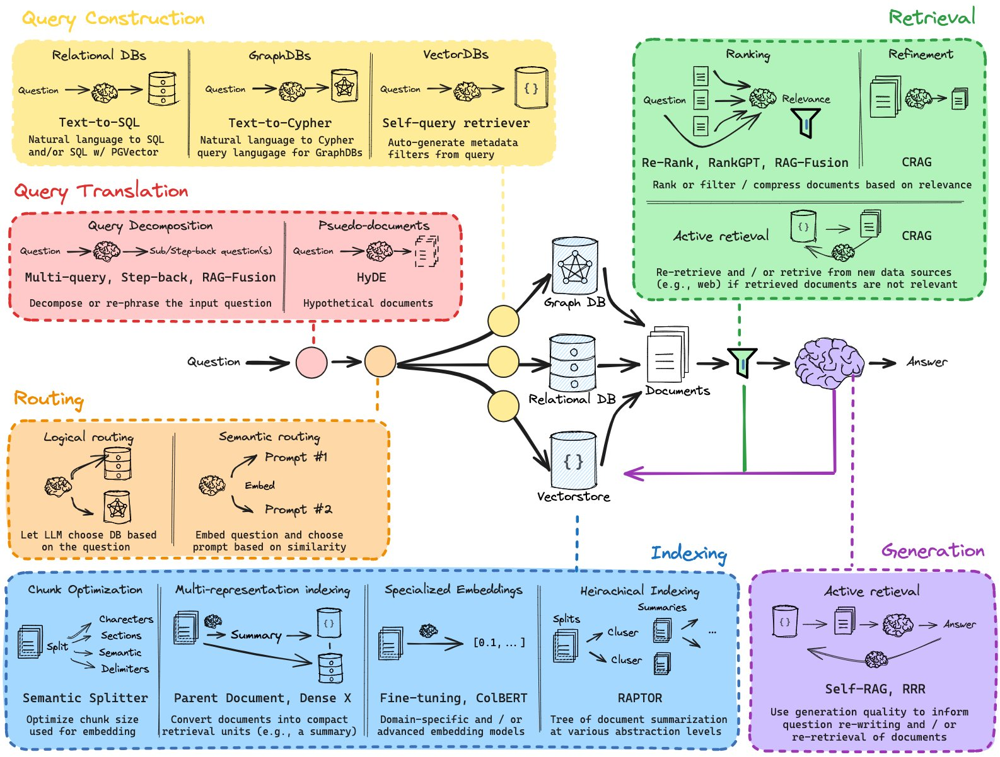

AI Agent 工程师可以简单分为以下三个阶段：
1. API 调用工程师：会用 LangChain/LangGraph 这些框架，能跑通官方 demo，遇到问题就翻文档。
2. 系统设计工程师：能理解 Agent 底层架构，知道 ReAct / Plan-and-Execute 这些模式怎么回事儿，能设计复杂的多 Agent 协作系统，懂得再生产环境里优化性能。
3. 基础设施架构师：能从零实现一个 Agent 框架，深度理解 LLM 的推理机制，能设计大规模 Agent 集群的调度系统。

先来抛出几个问题：
- Memo 的设计：长对话的上下文怎么处理？总结后怎么存储？多少轮后不支持回溯？如何评价回答质量？
- 语义 Embedding 模型如何选择？如何确定业务最适合的 Embedding 模型？（这块知识库和意图识别都会用到）
- 多意图并发以及 NER，怎么确定用户的真实意图？
- 中途任务强行结束怎么办？如何撤销？多工具分布调用如何解决？如何规划任务流程？
- 单/多模态 RAG 检索怎么做？如何提高检出？如何评价检出质量？多工具 Prompt 下，消融怎么展开？知识库文档怎么切片合适？
- 如何评价一个 Agent 的解决问题的质量？（是走完了用户指定的任务？还是各个任务节点完成的质量？）
- 为什么 LangGraph 要用 StateGraph？和普通的函数调用链有什么本质区别？
- 设计一个支持百万并发的 Agent 调度系统

Agent 系统的本质还是一个复杂的软件系统，依然需要以下工程能力以及对 AI 系统特有范式的理解和实践。
1. 可观测性
2. 高并发
3. 低延迟
4. 成本控制

## 1 基础概念

以下概念理解就行，不用背。比如 RAG，不能只知道喂知识库，要知道 RAG 解决的是 LLM 内部知识老旧和胡说八道（幻觉）的问题。核心挑战在于“精准检索”到相关性最强的上下文。
1. Embedding
2. 为什么需要向量数据库
3. Cosine Similarity
4. RAG[^rag]（检索增强生成）的本质
5. ReAct(Reasoning and Acting)[^react] 模式如何让 LLM 和外部工具交互
6. Function Calling 的工作流程

> 不能把 LLM 当成一个黑盒 API，需要知道他能干嘛和不能干嘛以及大概是怎么干的。
{: .prompt-info }

[_Attention is all you need_](https://arxiv.org/html/1706.03762v7) 这篇论文可以啃一遍，然后可以用 PyTorch 实现一个简单的 Transformer，过程也许会很痛苦，但是会对 LLM 底层原理有一个比较深刻的理解。

> **Prompt Engineering**
> 
> 学习 Few-shot/Chain-of-Thought(CoT) 这些技巧，自己设计一个 Prompt 模板库，积累一些好用的 Prompt。
{: .prompt-tip }

## 2 向量数据库

一开始我以为，向量数据库不就是「存 Embedding，然后做相似度搜索」吗？后来面试被问「为什么 Pinecone 用 HNSW 算法？Milvus 支持多种索引？什么场景下该选哪种？

对向量数据库的理解最好不要停留在会用的层面，也要懂其中的原理。需要花点时间搞明白**向量检索的核心算法**。
- HNSW（分层图结构）：查询快，但内存占用大。适合高 QPS 的场景。
- IVF（倒排索引 + 聚类）：适合大规模离线检索。
- Annoy（随机投影树）：内存占用小，但召回率稍低。

这里可以搞一个小课题：用 Milvus 搭一个支持千万级向量的检索系统，准备踩一下如下的坑：
- 冷启动问题：新文档的 Embedding 怎么快速索引？
- 增量更新：怎么在不重建索引的情况下更新向量？
- 多租户隔离：怎么在共享集群里做租户级别的数据隔离？

## 3 别停留在 Naive RAG

```python
def naive_rag(query):
    docs = vector_db.search(query, top_k=5)
    context = "\n".join(docs)
    response = llm.generate(f"Context: {context}\nQuery: {query}")
    return response
```
以上 RAG 的问题是：检索质量差、上下文窗口浪费、无法处理多跳推理、缺乏可解释性。Naive RAG 只是基础版本，生产环境是不够用的，要学着去做优化。

> - 搭一个完整的 RAG 系统，从文档上传到向量化到问答。
> - 对比不同的 Embedding 模型（OpenAI/Cohere/BGE）。
> - 实现 Hybrid Search + Reranking
{: .prompt-tip }

### 3.1 Query 优化

- Query Rewriting：把用户的问题改写成更适合检索的形式。
- Query Decomposition：把复杂问题拆成几个子问题。
- HyDE：先让 LLM 生成一个假设性的答案，再用这个答案去检索。

### 3.2 检索优化

- Hybrid Search：向量检索 + BM25，两个见过融合
- Reranking：用 Cross-Encoder 重新排序
- Contextual Compression：把无关内容压缩掉。

### 3.3 生成优化

- Self-RAG：让模型自己判断要不要检索
- CRAG：检测检索结果的质量，如果不行就会退到网络搜索。

## 4 Agent 架构

Agent 并不是 LLM + Tools，让 LLM 调用几个工具就完事儿了。Agent 的核心不是调用工具，而是推理过程的设计。

### 4.1 ReAct：最基础但最重要

ReAct 就是让 LLM 交替进行推理和行动。

> 从零实现一个 ReAct Agent。这个过程会真正理解 Agent 状态管理。
{: .prompt-tip }

```python
def react_agent(task):
    history = []
    while not is_finished():
        # 推理：下一步该做什么
        thought = llm.generate(f"Task: {task}\nHistory: {history}\nThought:")
        # 行动：执行工具
        action = parse_action(thought)
        observation = execute_tool(action)
        history.append({"thought": thought, "action": action, "observation": observation})
    return final_answer
```

这里的问题是：
1. 推理错误怎么办：需要 Reflexion[^reflexion] 机制，让 Agent 反思自己的错误。
2. 推理效率低怎么办：需要 Few-shot 示例，提供高质量的推理样本。
3. 任务太长怎么办：需要分层 ReAct，把任务拆解成子任务。

### 4.2 Pand-and-Execute：复杂任务

这个模式是先让 LLM 生成一个完整的计划，然后逐步执行。

```python
def plan_and_execute(task):
    # 生成计划
    plan = planner.generate_plan(task)
    # 执行计划
    results = []
    for step in plan:
        result = executor.execute(step, context=results)
        results.append(result)
        # 如果执行失败，重新规划
        if need_replan(result):
            plan = planner.replan(task, results)
    return results
```

这个模式的难点在于：
- 怎么生成高质量的计划：需要结构化输出。可以考虑用 Json Schema 约束。
- 什么时候出发重规划：执行失败、发现新信息、用户需求变更。
- 哪些步骤可以并行：需要分析步骤之间的依赖关系。

> - 学习 StateGraph 设计模式
> - 实现复杂的 Agent 工作流。包括条件分支、循环、并行结构
> - 构建一个 Plan-and-Execute Agent。
{: .prompt-tip }

### 4.3 Multi-Agent 协作：最复杂

怎么让多个 Agent 协作完成任务？
- 设计 Agent 通信协议
- 实现 Agent 编排系统
- 处理冲突和容错

## 5 Memory

Memory 系统的设计直接影响 Agent 的智能程度。

第一层：工作记忆（就是当前对话的上下文）

```python
class ConversationBuffer:
    def __init__(self, max_tokens=2000):
        self.messages = []
    
    def add_message(self, message):
        self.messages.append(message)
        # 超出token限制就删掉最早的消息
        while self.count_tokens() > self.max_tokens:
            self.messages.pop(0)
```

第二层：短期记忆（定期总结）

```python
class SummaryMemory:
    def __init__(self):
        self.summary = ""
        self.recent_messages = []
    
    def add_message(self, message):
        self.recent_messages.append(message)
        
        # 每10条消息总结一次
        if len(self.recent_messages) > 10:
            self.summary = llm.summarize(self.summary, self.recent_messages)
            self.recent_messages = []
```

第三层：长期记忆（向量数据库）

```python
class VectorMemory:
    def store(self, memory_item):
        self.vector_db.insert({
            "text": memory_item.text,
            "embedding": embed(memory_item.text),
            "timestamp": memory_item.timestamp,
            "importance": memory_item.importance
        })
    
    def retrieve(self, query):
        return self.vector_db.search(query, top_k=5)
```

## 6 Agent

### 6.1 动手写一个丐版的 RAG



不要上来就用 LangChain。先用 sentence-transformers 库把文档切块、生成向量存到一个 Faiss 或者 ChromaDB 的本地实例里。当用户提问时，手动去查向量库，把查出来的文本拼到 Prompt 中，再去调 OpenAI 的 API。过程中，你会遇到问题：
- 文档怎么切分效果最好？
- Top-K 设置成多少合适？
- 搜出来的东西不相关怎么办？

这些才是 Agent 工程真正的难点。

### 6.2 以真实场景驱动，构建一个代表作

需要一个体现综合能力的项目，需要麻雀虽小，五脏俱全。不要选 AI 聊天机器人这种大而空的目标，一个比较好的目标比如：智能投后报告分析助手。

业务场景：你所在的公司投资了很多初创企业，每个季度都会收到这些企业的 PDF 格式的财报和业务进展报告。目标是做一个 Agent，能快速阅读这些报告并回答关键问题，如：
- A 公司这个季度的营收环比增长了多少？
- B 公司的主要风险是什么？
- 把 C 和 D 公司的用户增长数据做个对比。

要实现这个需求，就需要折腾以下这些事儿：
- **复杂数据处理**：PDF 中的表格怎么提取？图片中的文字怎么办？参考下 unstructured.io 库。
- **核心 RAG 流程**：简单的文本块检索效果很差，就得研究更高级的 RAG 策略，比如 HyDE（Hypothetical Document Embeddings）或者 Multi-Query Retriver，甚至考虑 Graph RAG，把报告里的实体和关系抽出来建成知识图谱。
- **Agentic 逻辑和 Tool Use**：当需要计算环比增长时，LLM 是算不明白的。这个时候就必须引入 Tool Use / Function Calling。需要自定义一个工具，当 LLM 再识别出计算意图时自己去调用这个函数，拿到结果后再回答。

以上这个过程要怎么调试？LLM 为什么不按我们的意愿调用工具？也许需要用 LangGraph 或者自己实现一个 ReAct 循环来管理这个复杂的执行逻辑。

>最终，我们需要评估。Agent 做完以后，如何验证他比人看报告更好？我们需要构建一套评估体系。最简单的，找 20 份报告，设计 100 个问题和标注答案，形成一个评估集。然后用 Agent 跑一遍，使用 Ragas 这类框架计算一下 faithfulness（忠实度）、answer_relevancy（相关性）等指标。**没有评估，优化都是玄学。**评估里也会有很多坑，比如用户换个问法，生成的报告就驴唇不对马嘴，有可能是评估集太小，太干净了，没有覆盖真实、复杂的线上场景，需要自己踩坑。
{: .prompt-tip }

这个项目搞下来之后，简历和面试中就有料可聊，比如你可以讲
- PDF 是如何解析的，遇到了什么问题
- 对比了哪些 RAG 策略，为什么最终选了这个方案
- 如何设计和调试 Tool
- 最重要的是，如何通过量化评估指标，提高了 Agent 的准确率，从 60% 提升到了 85%。

## 7 生产化工程

安全和可靠性：
- 输入输出验证。
- 工具访问控制。
- 错误处理和重试机制。

### 7.1 成本和延迟意识

LLM API 是按 token 烧钱的，一个设计不好的 Agent 链条，一个请求进来可能要调用 LLM 十几次，成本直接爆炸，所以我们可以考虑
- 怎么设计缓存策略？
- 怎么通过更小的模型（比如 fine-tune 一个本地模型）来处理某些固定任务？
- 怎么优化 Prompt 来减少 token 消耗？
- 并发和异步处理。

### 7.2 可观测性 Observability

一个 Agent 的执行过程是个复杂的黑盒，需要引入类似 LangSmith / WanDB 这样的工具去追踪每一次调用的 Prompt、返回结果、中间步骤、token 消耗。线上出了问题可以快速定位哪个环节出问题了。

> - Agent 追踪系统。
> - 实现指标收集和监控。
> - 构建可视化 Dashboard。
{: .prompt-tip }

### 7.3 模型和工具链

除了 OpenAI，还得了解开源模型，如 Llama、Mistral 系列。知道怎么用 vLLM 或者 Ollama 部署他们。向量数据库除了 Chroma，也得看看 Milvus, Weaviate 这种生产级的。

## 8 信息源

保持技术敏感度，每周看看 [cs.AI](https://arxiv.org/list/cs.AI/recent) 和 [cs.CL](https://arxiv.org/list/cs.CL/recent) 的最新论文。

### 8.1 GitHub 优质项目

- [Open Manus](https://github.com/FoundationAgents/OpenManus)
- [Agent Universe](https://github.com/agentuniverse-ai/agentUniverse)
- [Gemini cli](https://github.com/google-gemini/gemini-cli)
- [Kode](https://github.com/shareAI-lab/Kode-cli)

### 8.2 Cookbook

- [Happy LLM](https://datawhalechina.github.io/happy-llm/)：从零开始的大语言模型原理与实践
- [Easy VectorDB](https://datawhalechina.github.io/easy-vectordb/)：从零开始的向量数据库原理与实践
- [All in RAG](https://datawhalechina.github.io/all-in-rag/)：大模型应用开发实战：RAG 技术全栈指南
- [Hello Agents](https://datawhalechina.github.io/hello-agents/)：从零开始构建智能体
- [Base NLP](https://datawhalechina.github.io/base-nlp/)：从 NLP 到 LLM
- [Tiny Universe](https://github.com/datawhalechina/tiny-universe)：大模型白盒子构建指南 —— 一个全手搓的Tiny-Universe
- [Handly Ollama](https://datawhalechina.github.io/handy-ollama/)：动手学 Ollama，CPU玩转大模型部署

---

[^rag]: [Retrieval-Augmented Generation for Knowledge-Intensive NLP Tasks](https://arxiv.org/pdf/2005.11401)
[^react]: [ReAct: Synergizing Reasoning and Acting in Language Models](https://arxiv.org/pdf/2210.03629)
[^reflexion]: [Reflexion: Language Agents with Verbal Reinforcement Learning](https://arxiv.org/pdf/2303.11366)