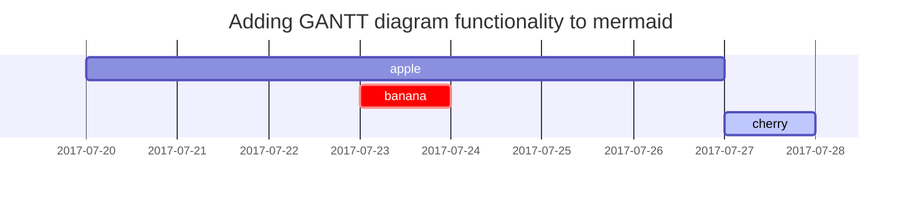

---
# the default layout is 'page'
# Add Markdown syntax content to file `_tabs/about.md`{: .filepath } and it will show up on this page.
icon: fas fa-info-circle
math: true
mermaid: true
order: 4
---

```bash
import this
```

> ##### the Zen of Python, by Tim Peters
> 
> - Beautiful is better than ugly. 优美胜于丑陋
> - Explicit is better than implicit. 明了胜于晦涩
> - Simple is better than complex. 简洁胜于复杂
> - Complex is better than complicated. 复杂胜于凌乱
> - Flat is better than nested. 扁平胜于嵌套
> - Sparse is better than dense. 间隔胜于紧凑
> - Readability counts. 可读性很重要
> - Special cases aren't special enough to break the rules. 任何特例都不足够违背这些原则
> - Although practicality beats purity. 实用性高于纯粹性]
> - Errors should never pass silently. 但是错误永远不能静默处理
> - Unless explicitly silenced. 除非明确需要
> - In the face of ambiguity, refuse the temptation to guess. 当存在多种可能，不要尝试去猜测
> - There should be one-- and preferably only one --obvious way to do it. 而是尽量找一种，最好是唯一一种明显的解决方案。
> - Although that way may not be obvious at first unless you're Dutch. 虽然这并不容易，因为你不是Python之父
> - Now is better than never. 做好过不做
> - Although never is often better than right now. 但不假思索就动手还不如不做
> - If the implementation is hard to explain, it's a bad idea. 如果你如法向他们描述你的方案，那肯定不是一个好方案
> - If the implementation is easy to explain, it may be a good idea. 如果你可以非常简单的描述出你的方案，那这个方案也许是个好主意
> - Namespaces are one honking great idea -- let's do more of those! 命名空间是个绝妙的理念，我们应该多加利用
{: .prompt-tip }

> Write lots of code. Clone existing things as exercises. Learn deeply. Alternate trying yourself and reading literature. Be obsessive. -- John Carmack

> Most of my programming career has involved finding something neat, writing my own version to understand it & often throwing it away. -- Edward Kmett

> I program thos "clones" like I read papers: change a core part; redesign it. Gain progress or understanding why it is what it is.  --Edward Kmett

1. 很多事都是熟能生巧，没有足够的练习不要谈天赋。练习不是一味的重复，或者去完全复刻别人的代码，每一次练习都应该增加难度，有突破自己认知的成长。这样反复的经过输入、评估、输出、纠正，会有惊人的变化。
2. 英语水平决定了一个程序员的上限。
3. 要有良好的习惯，才能事半功倍。
4. 不要等准备好了再出发，优秀的程序员都是探路者。
5. 愚者困惑，智者提问。
6. 最简单的往往是最有效的。
7. 向成功者学习，向成功的项目学习。
8. 输出是最好的输入。
9. 一定要坚持，保持长时间学习，甚至终身学习的态度。
10. 一定要动手，不管例子多么简单，建议至少自己动手敲一遍看看是否理解了里头的细枝末节。
11. 一定要学会思考，思考为什么要这样，而不是那样。还要举一反三地思考。
12. 不要乱买书，不要乱追新技术新名词，基础的东西经过很长时间积累，会在未来至少 10 年通用。
13. 回顾一下历史，看看历史时间线上技术的发展，你才能明白明天会是什么样的。

--- 

# Special syntax

## 1. Title

```markdown
---
title: Text and Typography
description: Examples of text, typography, math equations, diagrams, flowcharts, pictures, videos, and more.
author: cotes
date: 2019-08-08 11:33:00 +0800
categories: [Blogging, Demo]
tags: [typography]
pin: true
math: true
mermaid: true
image:
  path: /commons/devices-mockup.png
  lqip: data:image/webp;base64,UklGRpoAAABXRUJQVlA4WAoAAAAQAAAADwAABwAAQUxQSDIAAAARL0AmbZurmr57yyIiqE8oiG0bejIYEQTgqiDA9vqnsUSI6H+oAERp2HZ65qP/VIAWAFZQOCBCAAAA8AEAnQEqEAAIAAVAfCWkAALp8sF8rgRgAP7o9FDvMCkMde9PK7euH5M1m6VWoDXf2FkP3BqV0ZYbO6NA/VFIAAAA
  alt: Responsive rendering of Chirpy theme on multiple devices.
---
```

## 2. Headings

```markdown
# H1 — heading
{: .mt-4 .mb-0 }

## H2 — heading
{: data-toc-skip='' .mt-4 .mb-0 }

### H3 — heading
{: data-toc-skip='' .mt-4 .mb-0 }

#### H4 — heading
{: data-toc-skip='' .mt-4 }
```

<!-- markdownlint-capture -->
<!-- markdownlint-disable -->

# H1 — heading
{: .mt-4 .mb-0 }

## H2 — heading
{: data-toc-skip='' .mt-4 .mb-0 }

### H3 — heading
{: data-toc-skip='' .mt-4 .mb-0 }

#### H4 — heading
{: data-toc-skip='' .mt-4 }
<!-- markdownlint-restore -->

## 3. Lists

### 3.1 Ordered list

```markdown
1. Firstly
2. Secondly
3. Thirdly
```

1. Firstly
2. Secondly
3. Thirdly

### 3.2 Unordered list

```markdown
- Chapter
  - Section
    - Paragraph
```

- Chapter
  - Section
    - Paragraph

### 3.3 ToDo list

```markdown
- [ ] Job
  - [x] Step 1
  - [x] Step 2
  - [ ] Step 3
```

- [ ] Job
  - [x] Step 1
  - [x] Step 2
  - [ ] Step 3

### 3.4 Description list

```markdown
Sun
: the star around which the earth orbits

Moon
: the natural satellite of the earth, visible by reflected light from the sun
```

Sun
: the star around which the earth orbits

Moon
: the natural satellite of the earth, visible by reflected light from the sun

## 4. Block Quote

```markdown
> This line shows the _block quote_.
```

> This line shows the _block quote_.

## 5. Prompts

```markdown
> An example showing the `tip` type prompt.
{: .prompt-tip }

> An example showing the `info` type prompt.
{: .prompt-info }

> An example showing the `warning` type prompt.
{: .prompt-warning }

> An example showing the `danger` type prompt.
{: .prompt-danger }
```

<!-- markdownlint-capture -->
<!-- markdownlint-disable -->
> An example showing the `tip` type prompt.
{: .prompt-tip }

> An example showing the `info` type prompt.
{: .prompt-info }

> An example showing the `warning` type prompt.
{: .prompt-warning }

> An example showing the `danger` type prompt.
{: .prompt-danger }
<!-- markdownlint-restore -->

## 6. Tables

```markdown
| Company                      | Contact          | Country |
| :--------------------------- | ---------------- | ------: |
| Alfreds Futterkiste          | Maria Anders     | Germany |
| Island Trading               | Helen Bennett    |      UK |
| Magazzini Alimentari Riuniti | Giovanni Rovelli |   Italy |
```

| Company                      | Contact          | Country |
| :--------------------------- | ---------------- | ------: |
| Alfreds Futterkiste          | Maria Anders     | Germany |
| Island Trading               | Helen Bennett    |      UK |
| Magazzini Alimentari Riuniti | Giovanni Rovelli |   Italy |

## 7. Links

```markdown
<http://127.0.0.1:4000>

The mathematics powered by [**MathJax**](https://www.mathjax.org/)
```

<http://127.0.0.1:4000>

[**MathJax**](https://www.mathjax.org/)

## 8. Footnote

```markdown
Click the hook will locate the footnote[^footnote], and here is another footnote[^fn-nth-2].
```

Click the hook will locate the footnote[^footnote], and here is another footnote[^fn-nth-2].

## 9. Inline code

```markdown
This is an example of `Inline Code`.
```

This is an example of `Inline Code`.

## 10. Filepath

```markdown
Here is the `/path/to/the/file.extend`{: .filepath}.
```

Here is the `/path/to/the/file.extend`{: .filepath}.

## 11. Code blocks

### 11.1 Common

````markdown
```text
This is a common code snippet, without syntax highlight and line number.
```
````

```text
This is a common code snippet, without syntax highlight and line number.
```

### 11.2 Specific Language

````markdown
```bash
if [ $? -ne 0 ]; then
  echo "The command was not successful.";
  #do the needful / exit
fi;
```
````

```bash
if [ $? -ne 0 ]; then
  echo "The command was not successful.";
  #do the needful / exit
fi;
```

### 11.3 Specific filename

````markdown
```sass
@import
  "colors/light-typography",
  "colors/dark-typography";
```
{: file='_sass/jekyll-theme-chirpy.scss'}
````

```sass
@import
  "colors/light-typography",
  "colors/dark-typography";
```
{: file='_sass/jekyll-theme-chirpy.scss'}


## 12. Mathematics

We use [**MathJax**][mathjax] to generate mathematics. For website performance reasons, the mathematical feature won't be loaded by default. But it can be enabled by:

[mathjax]: https://www.mathjax.org/

```yaml
---
math: true
---
```

After enabling the mathematical feature, you can add math equations with the following syntax:

- **Block math** should be added with `$$ math $$` with **mandatory** blank lines before and after `$$`
  - **Inserting equation numbering** should be added with `$$\begin{equation} math \end{equation}$$`
  - **Referencing equation numbering** should be done with `\label{eq:label_name}` in the equation block and `\eqref{eq:label_name}` inline with text (see example below)
- **Inline math** (in lines) should be added with `$$ math $$` without any blank line before or after `$$`
- **Inline math** (in lists) should be added with `\$$ math $$`

```markdown
$$
\begin{equation}
  \sum_{n=1}^\infty 1/n^2 = \frac{\pi^2}{6}
  \label{eq:series}
\end{equation}
$$

We can reference the equation as \eqref{eq:series}.

When $a \ne 0$, there are two solutions to $ax^2 + bx + c = 0$ and they are

$$ x = {-b \pm \sqrt{b^2-4ac} \over 2a} $$
```

$$
\begin{equation}
  \sum_{n=1}^\infty 1/n^2 = \frac{\pi^2}{6}
  \label{eq:series}
\end{equation}
$$

We can reference the equation as \eqref{eq:series}.

When $a \ne 0$, there are two solutions to $ax^2 + bx + c = 0$ and they are

$$ x = {-b \pm \sqrt{b^2-4ac} \over 2a} $$

## 13. Mermaid SVG

[**Mermaid**](https://github.com/mermaid-js/mermaid) is a great diagram generation tool. To enable it on your post, add the following to the YAML block:

```yaml
---
mermaid: true
---
```

```markdown
 gantt
  title  Adding GANTT diagram functionality to mermaid
  apple :a, 2017-07-20, 1w
  banana :crit, b, 2017-07-23, 1d
  cherry :active, c, after b a, 1d
```
{: file='mermaid'}



## 14. Picture

### 14.1 Default (with caption)

_Full screen width and center alignment_

```markdown
{: width="972" height="589" }
```
{: width="972" height="589" }

### 14.2 Left aligned

```markdown
{: width="972" height="589" .w-75 .normal}

{: w="972" h="589" .w-75 .normal}
```
{: width="972" height="589" .w-75 .normal}

### 14.3 Float to left

```markdown
{: width="972" height="589" .w-50 .left}
Praesent maximus aliquam sapien. Sed vel neque in dolor pulvinar auctor. Maecenas pharetra, sem sit amet interdum posuere, tellus lacus eleifend magna, ac lobortis felis ipsum id sapien. Proin ornare rutrum metus, ac convallis diam volutpat sit amet. Phasellus volutpat, elit sit amet tincidunt mollis, felis mi scelerisque mauris, ut facilisis leo magna accumsan sapien. In rutrum vehicula nisl eget tempor. Nullam maximus ullamcorper libero non maximus. Integer ultricies velit id convallis varius. Praesent eu nisl eu urna finibus ultrices id nec ex. Mauris ac mattis quam. Fusce aliquam est nec sapien bibendum, vitae malesuada ligula condimentum.
```

{: width="972" height="589" .w-50 .left}
Praesent maximus aliquam sapien. Sed vel neque in dolor pulvinar auctor. Maecenas pharetra, sem sit amet interdum posuere, tellus lacus eleifend magna, ac lobortis felis ipsum id sapien. Proin ornare rutrum metus, ac convallis diam volutpat sit amet. Phasellus volutpat, elit sit amet tincidunt mollis, felis mi scelerisque mauris, ut facilisis leo magna accumsan sapien. In rutrum vehicula nisl eget tempor. Nullam maximus ullamcorper libero non maximus. Integer ultricies velit id convallis varius. Praesent eu nisl eu urna finibus ultrices id nec ex. Mauris ac mattis quam. Fusce aliquam est nec sapien bibendum, vitae malesuada ligula condimentum.

### 14.4 Float to right

```markdown
{: width="972" height="589" .w-50 .right}
Praesent maximus aliquam sapien. Sed vel neque in dolor pulvinar auctor. Maecenas pharetra, sem sit amet interdum posuere, tellus lacus eleifend magna, ac lobortis felis ipsum id sapien. Proin ornare rutrum metus, ac convallis diam volutpat sit amet. Phasellus volutpat, elit sit amet tincidunt mollis, felis mi scelerisque mauris, ut facilisis leo magna accumsan sapien. In rutrum vehicula nisl eget tempor. Nullam maximus ullamcorper libero non maximus. Integer ultricies velit id convallis varius. Praesent eu nisl eu urna finibus ultrices id nec ex. Mauris ac mattis quam. Fusce aliquam est nec sapien bibendum, vitae malesuada ligula condimentum.
```

{: width="972" height="589" .w-50 .right}
Praesent maximus aliquam sapien. Sed vel neque in dolor pulvinar auctor. Maecenas pharetra, sem sit amet interdum posuere, tellus lacus eleifend magna, ac lobortis felis ipsum id sapien. Proin ornare rutrum metus, ac convallis diam volutpat sit amet. Phasellus volutpat, elit sit amet tincidunt mollis, felis mi scelerisque mauris, ut facilisis leo magna accumsan sapien. In rutrum vehicula nisl eget tempor. Nullam maximus ullamcorper libero non maximus. Integer ultricies velit id convallis varius. Praesent eu nisl eu urna finibus ultrices id nec ex. Mauris ac mattis quam. Fusce aliquam est nec sapien bibendum, vitae malesuada ligula condimentum.

### 14.5 Dark/Light mode & Shadow

The image below will toggle dark/light mode based on theme preference, notice it has shadows.

```markdown
{: .light .w-75 .shadow .rounded-10 w='1212' h='668' }
{: .dark .w-75 .shadow .rounded-10 w='1212' h='668' }
```

{: .light .w-75 .shadow .rounded-10 w='1212' h='668' }
{: .dark .w-75 .shadow .rounded-10 w='1212' h='668' }

## 15. Others

```markdown
<kbd>Keyboard Button</kbd>

<sub>sub</sub>
```

<kbd>Keyboard Button</kbd>

<sub>sub</sub>

## 99. Reverse Footnote

[^footnote]: The footnote source
[^fn-nth-2]: The 2nd footnote source

You can also take this [reference](https://chirpy.cotes.page/posts/write-a-new-post/#syntax)